# Claude Agentic AI Plan for **HealthCare‑GPT**

> **Purpose** – Establish a self‑orchestrating, Claude‑style agent framework that automates every stage of the HealthCare‑GPT lifecycle: data ingestion, fine‑tuning, evaluation, deployment, and continuous documentation.

---

## 1 · Vision & Scope

| Pillar               | Description                                                                                                                            |
| -------------------- | -------------------------------------------------------------------------------------------------------------------------------------- |
| **Automation‑First** |  Reduce human toil by letting agents run repeatable pipelines (data → model → docs) on a single dev machine or in CI.                  |
| **Domain Alignment** |  Keep the model up‑to‑date with new medical research by continuously ingesting `.csv`, `.md`, `.txt` drops into `HealthCareData/`.     |
| **Transparency**     |  Every agentic action produces artefacts in `docs/changelog/` and summaries in `docs/summaries/`, ensuring auditability.               |
| **Resource‑Aware**   |  Stay within 8‑16 GB RAM / consumer GPU constraints; agents manage batch‑sizes, mixed‑precision, and checkpoint pruning automatically. |

---

## 2 · Agent Responsibilities

### 2.1 Data Curator

* Watch `HealthCareData/` for new or changed files.
* Trigger `scripts/preprocess.py` to regenerate `processed/` splits.
* Write a brief extraction report ➜ `docs/summaries/{DATE}_data_summary.md`.

### 2.2 Trainer ("LoopMaster")

* Launch fine‑tuning via `scripts/finetune.py`.
* Implements the **Training Loop**:

  1. **Batch Processing** – Pulls token chunks (context ≤ 512) in DataLoader.
  2. **Forward Pass** – Runs model → logits.
  3. **Loss Computation** – Cross‑entropy vs. shifted targets.
  4. **Backward Pass** – `loss.backward()` with AMP (fp16) when GPU present.
  5. **Optimizer Step** – `AdamW` update.
  6. **LR Scheduler** – Warm‑up + cosine decay.
  7. **Logging/Eval** – Every *N* steps logs loss, risk‑token accuracy to Weights & Biases; validates on `val_data.txt`.
  8. **Checkpointing** – Saves best & last to `models/finetuned/`.
* Emits training metrics ➜ `docs/summaries/{DATE}_train_summary.md`.

### 2.3 Evaluator

* Runs `scripts/evaluate.py` after each epoch or on demand.
* Computes Accuracy, Precision, Recall, F1 on held‑out CSV.
* If `load_best_model_at_end=True`, reloads best ckpt for final metrics.

### 2.4 Deployer

* Builds/updates Docker image, refreshes `serve.py` container.
* Performs a smoke inference test; if pass, tags Git commit & triggers changelog entry.

### 2.5 Doc‑Bot

* Generates/updates:

  * `docs/changelog/{DATE}__{slug}.md` – bullet list of meaningful changes.
  * `docs/summaries/{DATE}_summary.md` – plain‑language overview for stakeholders.
* Keeps this **Claude Plan** synced: inserts new agent roles/steps when pipeline evolves.

---

## 3 · Workflow Orchestration

```mermaid
graph TD
    A[File drop \n in HealthCareData] -->|notify| B(Data Curator)
    B --> C{Preprocessed?}
    C -->|yes| D(Trainer)
    C -->|no| B
    D --> E(Evaluator)
    E --> F{Metrics ok?}
    F -->|yes| G(Deployer)
    F -->|no| H(Adjust hyperparams & retrain)
    G --> I(Doc‑Bot)
```

*Agents communicate via JSON RPC over an internal message bus (RabbitMQ or simple cron/CLI for local).*
*Each block can be run manually via make targets: `make curate`, `make train`, `make evaluate`, `make deploy`, `make docs`.*

---

## 4 · File & Naming Conventions

| Directory             | Purpose                       | Naming Rule                            |
| --------------------- | ----------------------------- | -------------------------------------- |
| **docs/plans/**       | Long‑form design docs & RFCs  | `*.md` (snake‑case)                    |
| **docs/changelog/**   | Machine‑generated change sets | `YYYYMMDD__slug.md`                    |
| **docs/summaries/**   | Daily / run summaries         | `YYYYMMDD_summary.md`                  |
| **models/finetuned/** | Checkpoints                   | `epoch{N}_valLoss{X}.pt` + `latest.pt` |

---

## 5 · Future Extensions

* Switch to distributed training with 🤗 Accelerate when > 1 GPU detected.
* Add retrieval‑augmented generation (RAG) for research Q\&A.
* Integrate semantic versioning; have Doc‑Bot update `VERSION` file.

---

### Author & Revision

*Initial draft* – generated by ChatGPT **15 May 2025**.
Maintainer: *Agent Doc‑Bot*.
